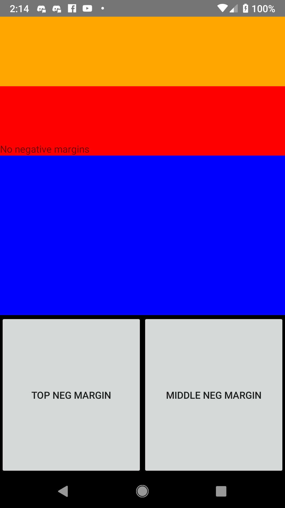
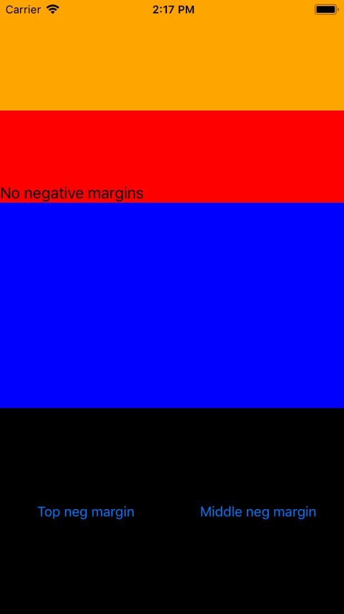
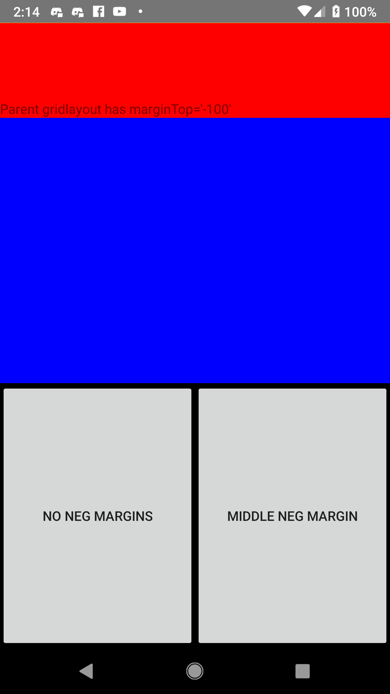
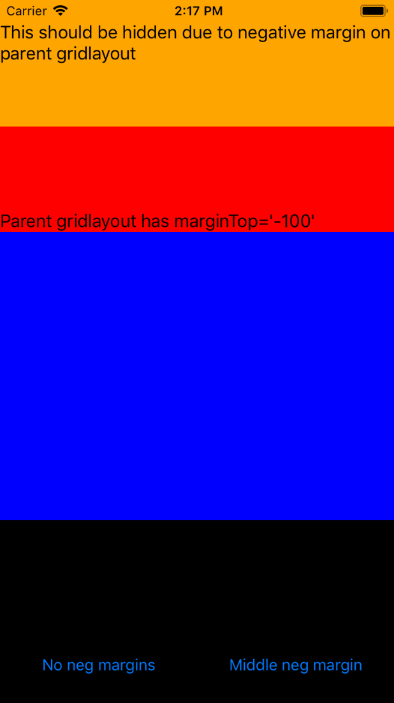
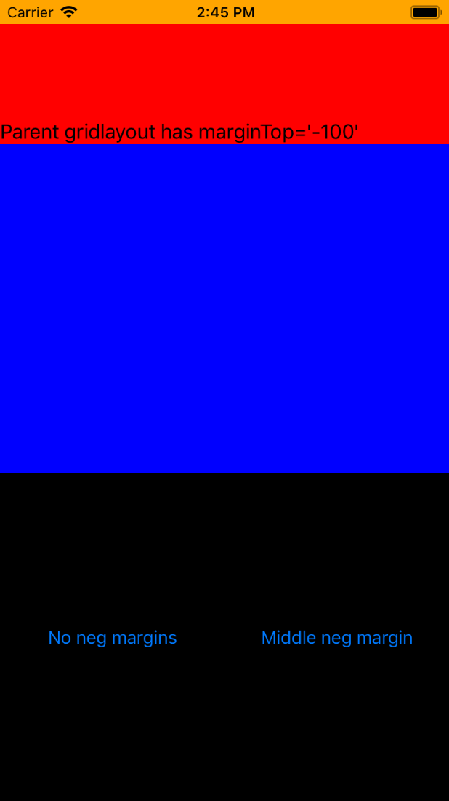
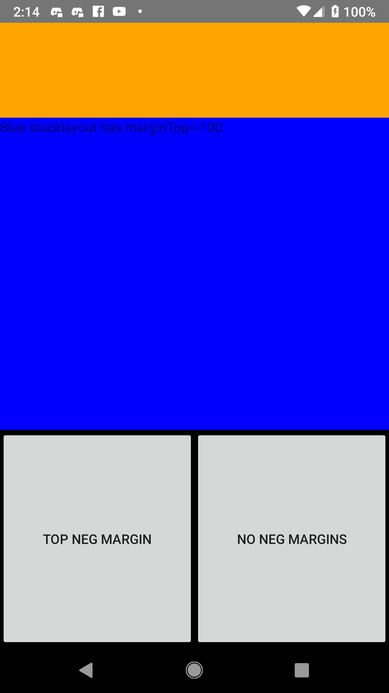
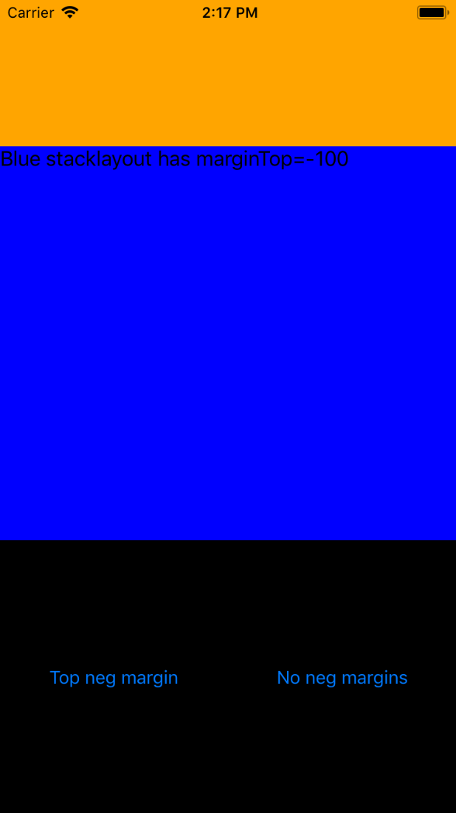

This repo demos slight differences in negative margins between Android and iOS in Nativescript version 5.1.

# No negative margins
Android:

iOS:

# Negative Margin on Parent Gridlayout
Notice that on iOS, the bottom buttons are shifted down instead of being centered like they are without any negative top margin, and that the top orange stack (with height 100) should be hidden. In NS version 4.2 on iOS, everything shifted upward as expected (as shown below).

Android:

iOS (v5.1):

iOS (v4.2):

# Negative Margin on Middle (Blue) Stacklayout
This has the same result on both android and iOS.

Android:

iOS:

